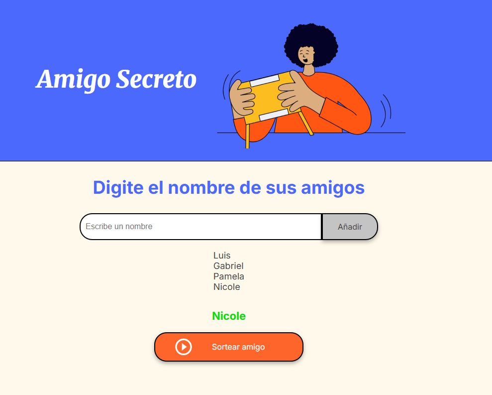

# Amigo Secreto 🎁

Aplicación web simple para agregar nombres de amigos y realizar un sorteo aleatorio que determine quién es el "amigo secreto".  
Este proyecto forma parte del **Oracle ONE Challenge**.

## 📸 Capturas de pantalla




---

## 📋 Descripción del desafío

En este desafío desarrollé una aplicación que permite:
- **Agregar nombres** a una lista mediante un campo de texto y un botón `Añadir`.
- **Validar la entrada** mostrando una alerta si el campo está vacío.
- **Visualizar la lista** de nombres ingresados debajo del campo de entrada.
- **Sortear un amigo** seleccionando aleatoriamente un nombre de la lista y mostrando el resultado en pantalla.

---

## 🛠️ Tecnologías utilizadas
- HTML5
- CSS3
- JavaScript

---

## 🚀 Cómo ejecutar el proyecto
1. Clona este repositorio:
   ```bash
   git clone https://github.com/MarioGhost25/challenge-amigo-secreto.git
